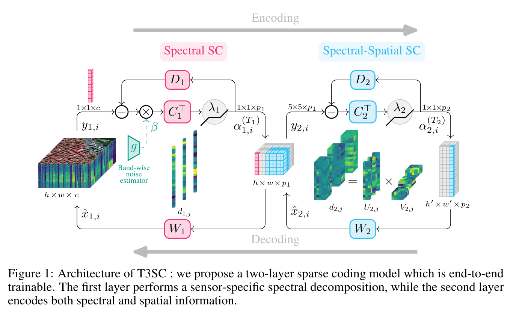

# A Trainable Spectral-Spatial Sparse Coding Model for Hyperspectral Image Restoration

Official PyTorch implementation of the paper _A Trainable Spectral-Spatial Sparse Coding Model for Hyperspectral Image Restoration_ (Neurips 2021).

[`[arxiv]`](https://arxiv.org/abs/2111.09708)




## Installation

Developped with Python 3.8.8.
```
$ git clone https://github.com/inria-thoth/T3SC
$ cd T3SC && pip install -r requirements.txt
```

## Training


To launch a training:
```
$ python main.py data={icvl,dcmall} noise={constant,uniform,correlated,stripes} [+noise-specific params]
```
Data should be downloaded automatically to `data/ICVL` or `data/DCMall` if it is not there already.

### Examples

ICVL dataset with constant gaussian noise:
```
$ python main.py data=icvl noise=constant noise.params.sigma=50
```

Washington DC Mall dataset with band-dependant gaussian noise:
```
$ python main.py data=dcmall noise=uniform noise.params.sigma_max=55
```

ICVL dataset with stripes noise:
```
$ python main.py data=icvl noise=stripes
```


## Test

To test from a checkpoint:
```
$ python main.py mode=test data={icvl,dcmall} noise={constant,uniform,correlated,stripes} [+noise-specific params] model.ckpt=path/to/ckpt
```

Some pre-trained models can be found [here](http://pascal.inrialpes.fr/data2/tbodrito/t3sc/).

### Example
To test ICVL with constant noise:
```
$ python main.py mode=test data=icvl noise=constant noise.params.sigma=50 model.ckpt=path/to/icvl_constant_50.ckpt
```
